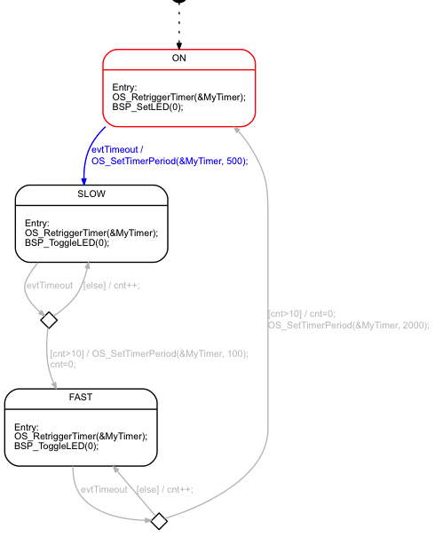

#Example that shows how to use the code generator with embos RTOS

This simple example shows how using state machines with a real-time operating system. In this design each state machine usually runs in the context of an own task. Each task executes a state machine (often called active object) in an endless while loop. The tasks wait for new events to be processed from the state machine. In case no event is present the task is set in idle mode from the RTOS. In case one or more new events are available the RTOS wakes up the task. The used RTOS mechanism for event signaling can be different. But often a message queue is used. Events might be stored in the event queue from various sources. E.g. from within another task or from inside an interrupt service routine. This design can be realized with every real-time operating system. Only the event transport mechanisms might differ. 

See www.sinelabore.com main page for other examples how to use state machines for different embedded system architectures.

The implemented machine just changes the blink frequency for demonstration purposes.
