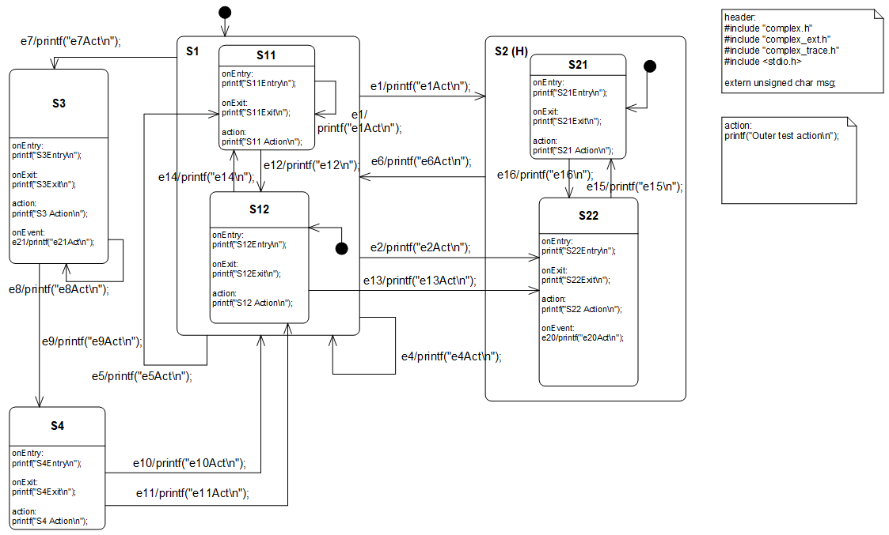
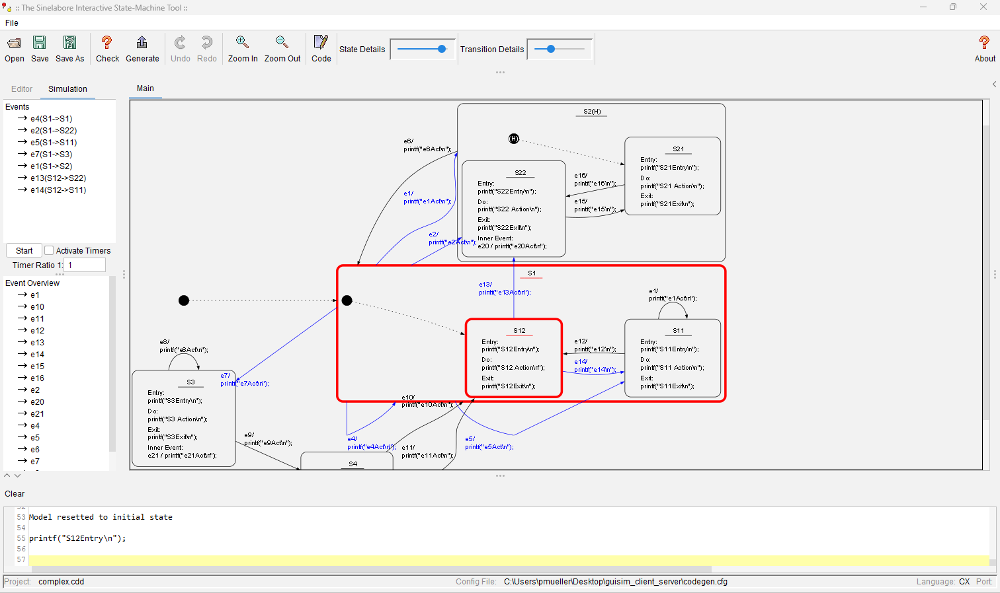
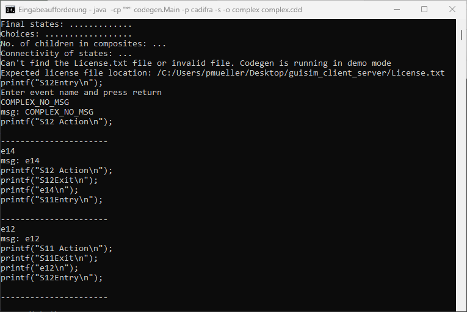

# State Machine Trace Example

This example (state machine created with Cadifra UML editor) demonstrates:
- How to trace state machine events and visualize them in real-time
- How to interactively work with state machines using the sinelabore graphical interface



## Simulate State Machines Interactively

The sinelabore code generator can be used to visualize a state machine model and interactively test it by sending events to the state machine generated from various UML state machine modeling tools (e.g., Enterprise Architect). 
The simulator reacts by showning the new state set as well printing all "executed" entry/do/exit/actions code.
The simulator can be started in GUI mode (requires Graphviz dot) and in console mode.

In GUI mode, the active state set as well as the possible transitions to other states is highlighted in a graphical manner. In console mode, the current state set is shown as text.

To start the code generator in GUI mode run (note the capital S). The layout is different from the origianl Cadifra
model due to the automatic layout engine used in the simulator.
```bash
java -cp "your path:*" codegen.Main -S -p CADIFRA -o complex complex.cdd
```



To start the code generator in console mode run:
```bash
java -cp "your path:*" codegen.Main -s -p CADIFRA -o complex complex.cdd
```



## Trace State Machine Events from an Embedded Target

The state machine code generator allows you to optionally add trace code into the generated source code. The trace code calls a user-provided function. 
A simple option is to just print the currently processed event. It is also possible to send the processed event via UDP to the GUI simulator. How to do this is explained in this section.

The example consists of two main components:
1. A state machine implementation in C that processes events and sends trace messages to a multicast port
2. A graphical interface (GUI) that visualizes the state machine's behavior by listening to the multicase messages and extracting the event information from it.
This is done by the code generator automatically when started in simulation mode (see above).

### Communication

The communication between the state machine and GUI uses UDP multicast:
- Multicast Address: `239.1.1.1`
- Port: `4445`
- Both components can run on the same machine or different machines in the same network

### Real-World Usage

In a real embedded system, events might:
- Arrive at high speed and need buffering
- Come through various interfaces (UART, CAN, etc.)
- Require a relay program to convert between protocols

For example, a relay program might:
1. Receive events from a serial interface
2. Convert them to UDP multicast packets
3. Send them to the GUI for visualization

### Running the Example

#### Prerequisites
- Java Runtime Environment and dot (for the GUI)
- C compiler (for the state machine)
- Network connectivity between machines (if running on different systems)

#### Steps

1. Start the GUI:
   ```bash
   java -cp "your path:*" codegen.Main -S -p CADIFRA -o complex complex.cdd
   ```
   Note: Adjust the path to codegen.jar according to your installation.
   If you encounter issues (e.g., dot path not defined), resolve them before proceeding.

2. Run the state machine:
   - Windows: `complex.exe`
   - Linux/Mac/FreeBSD: `./complex`
   
   The program executes a predefined sequence of events. 
   To modify the event sequence, edit the file main.c and recompile.

### Building

#### Windows
```bash
nmake -f Makefile.nmake
```

#### Linux/Mac/FreeBSD
```bash
make
```

### Architecture

#### Basic Example
```
┌──────┐               ┌───────────────┐ 
│ GUI  │ <--- UDP ---  │ State Machine │
│      │               │ PC (main.c)   │
└──────┘               └───────────────┘
```

#### Setup with connection to Embedded Target
```
┌──────┐               ┌───────────────┐                    ┌──────────────────┐
│ GUI  │ <--- UDP ---  │ Serial to UDP │ <--- Serial -----  │ Real Target      │
│      │               │ Relay Program │                    │ Running State    │
└──────┘               └───────────────┘                    │ Machine Code     │
                                                            └──────────────────┘
```
An example that shows the connection between the Asuro mobile robot and the GUI is available here:
https://www.sinelabore.de/doku.php/wiki/examples/mobile_robot_i