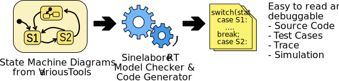

# Sinelabore enables embedded developers to effectively combine event-driven architecture, hierarchical state machines, model-based design and automatic code generation.

Many embedded systems are likely candidates for implementation as finite state machines. A system that must sequence a series of actions or that must handle inputs differently depending on the mode it is in is often best implemented as a finite state machine. Typical examples are control-logic-oriented applications such as metering, monitoring, and control applications.

# Specifically for Embedded Developers

SinelaboreRT focus is on generation of readable and maintainable code from flat or hierarchical UML state machine diagrams. With its unique features the tool covers perfectly the requirements of embedded real-time and low-power application developers coding in C / C++. The generated code is independent of CPU and operating system. For IoT applications where parts of the application are implemented in Java / Python / C# / Lua / Rust or Swift, the code can also be generated in these languages. A payback is usually given already immediately.

Use your existing favourite modelling tool and generate code from it with an easy-to-use command line tool. Or use the built editor to create state machines within minutes. Automatic model checks warn from design flaws. Configure the generation process according to your needs. Simulate your model. Generate trace code automatically if needed. All major state diagram features like hierarchical states, regions, history, sub-machines … are supported.

Download & Try it! There are examples for various UML modelling tools and target languages for having a quick start

- LinuxMacBSD: Folder of examples that can be built on the command line with Make and gcc and friends.

See more at www.sinelabore.com
