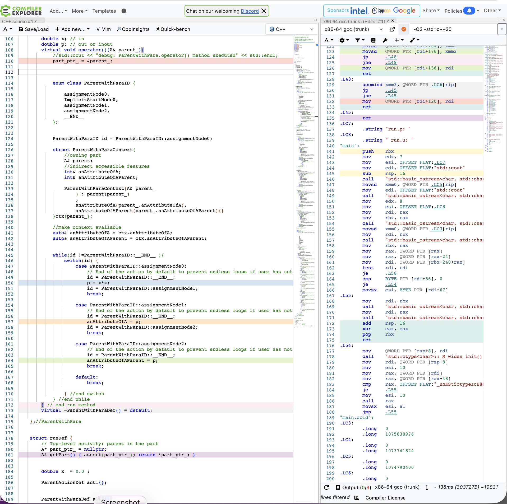

 # Traffic light system - example model for the SysML v2 to C++ code generator.
 
 A traffic management center (TMC) supervises two traffic lights. The model
 demonstrates parts with ports and connections, inheritance between parts,
 parallel state machines and actions that drive parts of another definition.

`*.sysml` models: the SysML v2 textual input.
`main.cpp` and `system.h`: a minimal C++ driver / glue code for running the generated code.
`Makefile` (and sometimes `codegen.cfg`): build configuration to generate and compile the example
'../framework.h' minimal runtime framework to be able to execute the generated C++ code

# Code Generation Considerations
The code generator aims to keep the generated code as close as possible to the SysML v2 model, preserving the same structure and intent of the actions and control/data relationships.

Even though this can lead to code that looks verbose, modern optimizing compilers simplify the model-close generated code effectively, so you still get good runtime performance while preserving the original structure.

This can be proven using Compiler Explorer (https://godbolt.org), as shown in the next picture: you can see how few assembly lines are generated from the complete C++ code produced by the `tst_action_basic` example.

Compiler Explorer (https://godbolt.org) is an online playground for C/C++ (and other languages) that lets you compile the same code with many compiler versions and optimization settings. After compilation, it shows what the compiler produces (for example, generated assembly and intermediate representations) so you can directly inspect what optimizations are applied. This is handy to verify that the verbose, model-close generated code still turns into efficient machine code on modern toolchains.