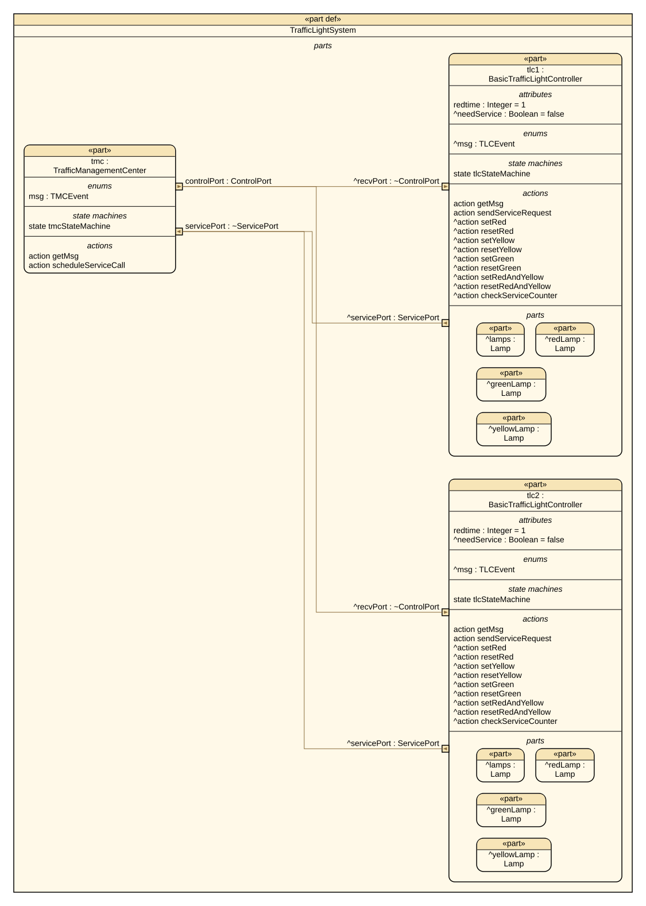
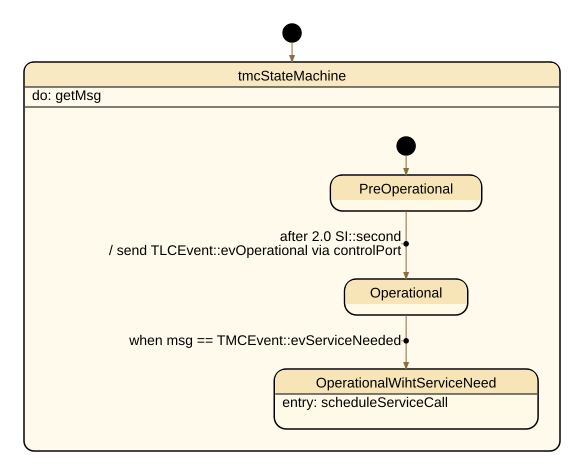
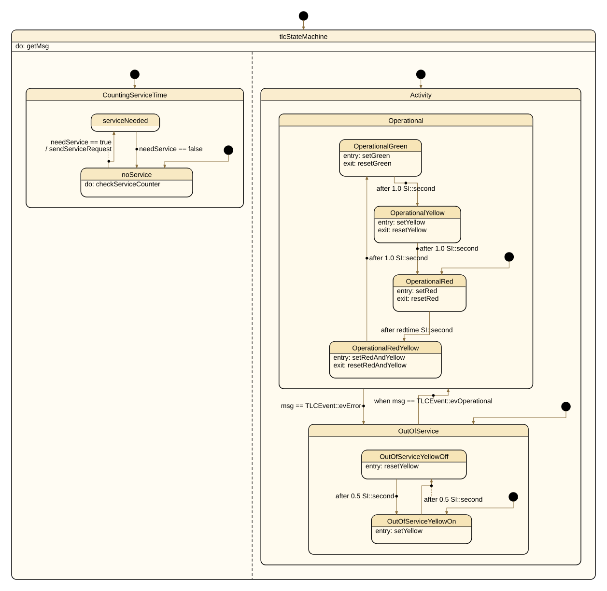

# Traffic Light System

Example model for the SysML v2 code generator, generated twice: once as C++ and once as
Python.

A traffic management center (TMC) supervises two traffic lights. The model is small enough to
read in one sitting, but rich enough to show the features you need for an executable system
model: parts with ports and connections, inheritance between parts, parallel state machines,
collections, and actions that drive parts other than their own.

The whole system is described in two text files. There is no modeling tool involved — run
`make` and you get a running executable, a running Python program, and the drawings below.

## Structure



One management center supervises two identical traffic lights. Control events flow from
`tmc.controlPort` to each `recvPort`; service requests flow back from each `servicePort` to the
center — all four connections are declared in `TrafficLightSystem`. Both lights are instances
of `BasicTrafficLightController`, which specializes the `TrafficLightController` template; that
is the inheritance arrow at the bottom of the diagram.

| Element | Role |
|---|---|
| `TrafficLightSystem` | Composes one TMC (`tmc`) and two traffic lights (`tlc1`, `tlc2`), and connects their ports |
| `TrafficManagementCenter` | Sends control events, receives service requests |
| `TrafficLightController` | Template part: lamps, timing, and the lamp switching actions |
| `BasicTrafficLightController :> TrafficLightController` | Adds the concrete state machine and shortens `redtime` |
| `Lamp` | Lives in the `Signalling` package (`signalling.sysml`) |

The full package tree, including every item, port and action definition, is in
[`diagrams/01_tree_TrafficLight.svg`](diagrams/01_tree_TrafficLight.svg) — it is too wide to
show inline.

The lamps are modeled as a collection (`lamps [*]`) with `redLamp`, `yellowLamp` and
`greenLamp` as named members, so both individual and collective access are possible. Each
`Lamp` counts its own switch operations — that counter is what eventually triggers the
maintenance request, and it makes a good assertion point for a test.

## Behaviour

### The management center



The TMC starts in `PreOperational`. After two seconds it broadcasts `TLCEvent::evOperational`
to both traffic lights over `controlPort` and enters `Operational`. When a traffic light
reports that it needs maintenance, it moves on to `OperationalWihtServiceNeed` and schedules a
service call.

### The traffic light



Each traffic light runs a **parallel state machine**. The diagram shows the two regions side by
side; they run independently of each other:

**`Activity`** — until the operational event arrives, the light is `OutOfService` and blinks
yellow at 0.5 s. On `evOperational` it enters `Operational` and cycles
red → red+yellow → green → yellow. The red phase lasts `redtime` seconds, the others one
second. `TLCEvent::evError` sends it back to `OutOfService`.

**`CountingServiceTime`** — independently of the light phase, `checkServiceCounter` watches how
often the lamps have been switched. Above the threshold, `needService` is set, the light
reports it to the TMC over `servicePort`, and the TMC schedules a service call.

## Files

The model and the drawings belong to no language and live here; each target keeps its driver
and its Makefile in its own directory, so one generated module cannot tread on the other.

| File | Purpose |
|---|---|
| `tl.sysml` | The system model |
| `signalling.sysml` | The `Signalling` package with the `Lamp` part — listed on the same codegen command |
| `Makefile` | Draws the diagrams and builds both targets |
| `codegen.cfg` | Generator settings; both targets link to this one file |
| `cpp/main.cpp` | Minimal C++ driver: constructs the system and runs the simulation loop |
| `cpp/Makefile` | Generates `system.h` and builds `./testcase` |
| `python/main.py` | The same driver in Python |
| `python/Makefile` | Generates `system.py` |
| `python/framework.py` | Symlink to `../../framework.py`, so the generated module finds its runtime |
| `TrafficLight.ipynb` | Jupyter notebook that renders diagrams from the model (see below) |
| `diagrams/` | Diagrams exported from that notebook |
| `../framework.h`, `../framework.py` | Minimal runtime: part base class, ports, timers |

`system.h` and `system.py` are written by `make` and are not checked in; do not edit them.

## Build and run

```bash
export CODEGEN_PATH=/path/to/sinelabore/bin

make              # the drawings, then both targets
make run-cpp      # build and run the C++ driver
make run-python   # generate and run the Python driver
```

Either target can be built on its own — `make -C cpp` and `make -C python`, or `make` inside
that directory.

Both targets list the two `.sysml` files on one codegen command and write them into a single
module, `system.h` or `system.py` (`-o system`). Anything only reached via `import` / `-I`
would stay bind-only; `signalling.sysml` is listed so `Lamp` is generated. Both generate with
`-d`, so each action and accept reports the instance that ran it.

The driver is deliberately plain — no subclassing, no hand-written behavior. `init()` builds
the sub-parts and wires every `connect` of the model; `process()` is one scan of the whole
system, so nothing here names a part:

```cpp
TrafficLightSystem tls;
tls.init();

for (int i = 0; i < 80; i++) {
    tls.process();
    std::this_thread::sleep_for(std::chrono::milliseconds(100));
}
```

```python
tls = TrafficLightSystem()
tls.init()

for _ in range(80):
    tls.process()
    time.sleep(0.1)
```

Everything you see at run time comes from the model. The sleep interval is the simulation
tick; keep it well below the shortest timeout in the model (0.5 s here).

Output looks like this — each line names the instance and what it ran:

```
debug: TrafficLightSystem.tmc.getMsg [action]
debug: TrafficLightSystem.tlc1.setYellow [action]
debug: TrafficLightSystem.tlc1.yellowLamp.setOn [action]
debug: TrafficLightSystem.tlc1.checkServiceCounter [action]
debug: TrafficLightSystem.tlc1.tlcStateMachine.OutOfServiceYellowOn [transition] -> OutOfServiceYellowOff
```

The two targets are generated from one model and run the same way, so their output is the
same line for line — `make run-cpp` and `make run-python` can be diffed against each other.

## What this example demonstrates

| Feature | Where to look in `tl.sysml` |
|---|---|
| Ports, items and connections | `ControlPort` / `ServicePort`, the `connect` lines in `TrafficLightSystem` |
| State machine as a **usage** (`state sm { … }`) | `tmcStateMachine`, `tlcStateMachine` |
| Parallel regions | `state tlcStateMachine parallel` with `Activity` and `CountingServiceTime` |
| Timed and guarded transitions | `accept after 0.5[SI::second]`, `accept when msg == …` |
| Part specialization and redefinition | `BasicTrafficLightController :> TrafficLightController`, `attribute :>>redtime=1` |
| Collections | `abstract ref part lamps : Lamp [*]` with `subsets` members |
| Performing an action of another part | `action references redLamp.setOn` in `setRed`, `perform yellowLamp.setOff` in `resetYellow`, and the named form `action ryOn references …` in `setRedAndYellow` — the example deliberately shows all three spellings |
| Sending over a port | `send TLCEvent::evOperational via controlPort` |
| Units on values | `2[SI::second]`, `2.2 [SI::W]` in `signalling.sysml` |

Reference documentation for each of these is at
<https://www.sinelabore.com/docs/symlv2/>.

## Diagrams

Every picture in this file is rendered **from the model**, not drawn by hand. Nothing needs to
be kept in sync manually — regenerate them whenever the model changes.

`diagrams/` holds a further set of views as SVG:

| File | View |
|---|---|
| `01_tree_TrafficLight.svg` | Structure of the whole package, down to every item and port definition |
| `02_interconnection_TrafficLightSystem.svg` | Parts and their port connections |
| `03_state_tlcStateMachine.svg` | The traffic light's parallel state machine |
| `04_state_tmcStateMachine.svg` | The management center's state machine |
| `05_action_setRedAndYellow.svg` | One action as an activity diagram |

They were produced with the SysML v2 pilot implementation through `TrafficLight.ipynb`. That
notebook is also a convenient way to check the model against the reference implementation —
it is stricter than any code generator. See
<https://www.sinelabore.com/docs/symlv2/tooling/>.

## Notes

- Tested on macOS with `clang++` and CPython 3. The Makefiles list both model files by name;
  on a case-sensitive file system those names must match the files exactly.
- `init()` on the top part is required — it constructs the sub-parts and wires the
  connections. A state machine initializes itself on its first step, so nothing else has to be
  called before the loop.
- `make clean` removes the generated modules, the executable and the drawings.
