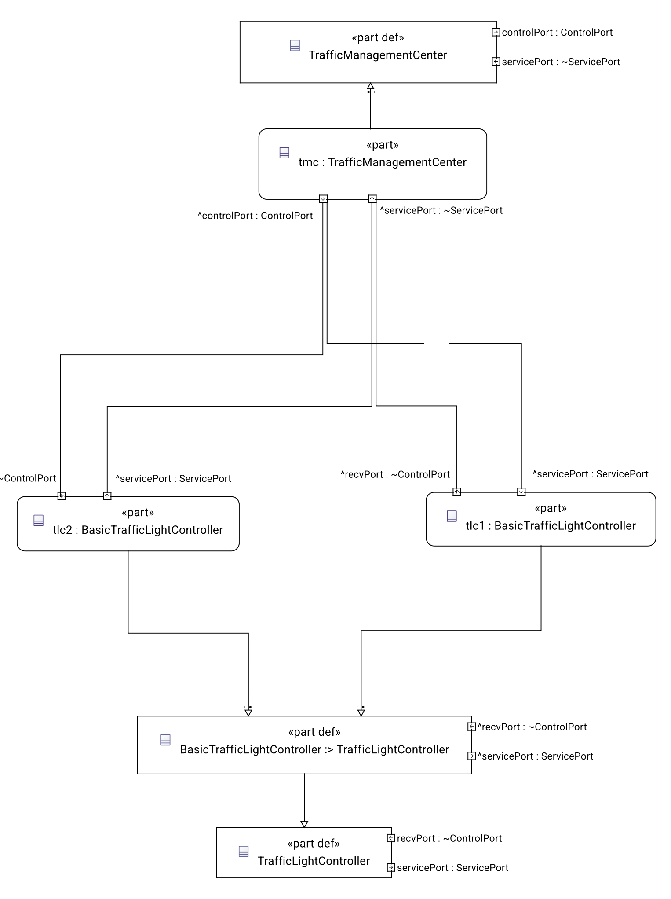
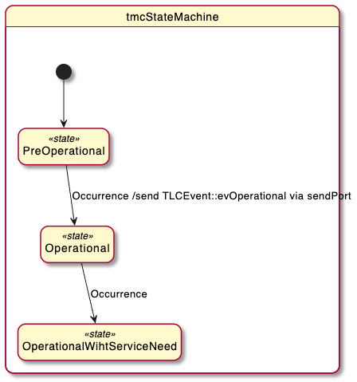
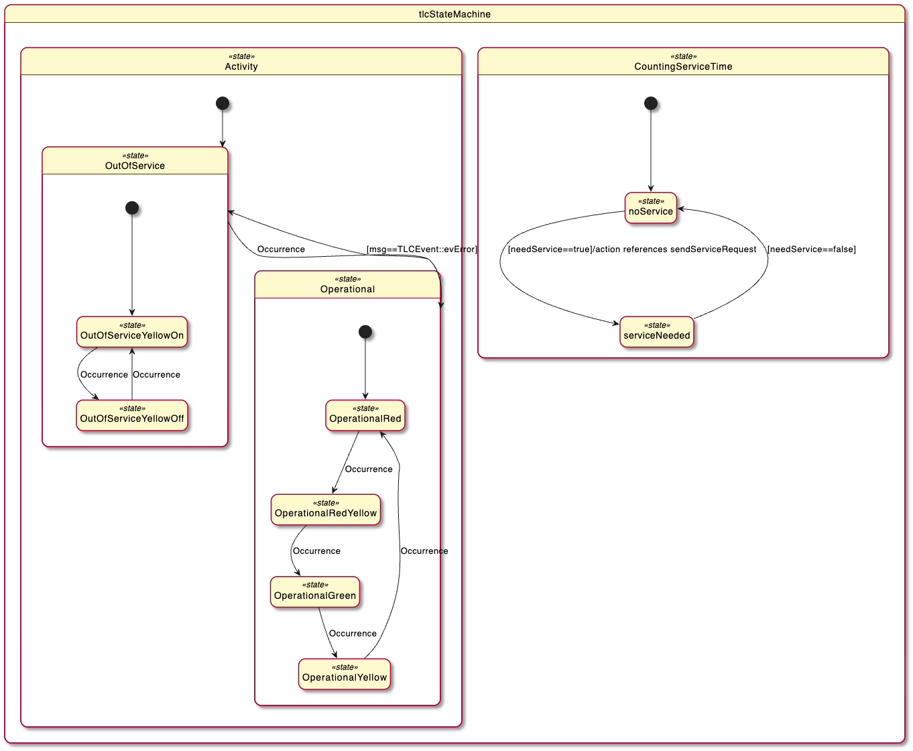

# Traffic Light System

Example model for the SysML v2 → C++ code generator.

A traffic management center (TMC) supervises two traffic lights. The model is small enough to
read in one sitting, but rich enough to show the features you need for an executable system
model: parts with ports and connections, inheritance between parts, parallel state machines,
collections, and actions that drive parts other than their own.

The whole system is described in two text files. There is no modeling tool involved — run
`make` and you get a running executable.

## Structure



One management center supervises two identical traffic lights. Control events flow from
`tmc.controlPort` to each `recvPort`; service requests flow back from each `servicePort` to the
center — all four connections are declared in `TrafficLightSystem`. Both lights are instances
of `BasicTrafficLightController`, which specializes the `TrafficLightController` template; that
is the inheritance arrow at the bottom of the diagram.

| Element | Role |
|---|---|
| `TrafficLightSystem` | Composes one TMC (`tmc`) and two traffic lights (`tlc1`, `tlc2`), and connects their ports |
| `TrafficManagementCenter` | Sends control events, receives service requests |
| `TrafficLightController` | Template part: lamps, timing, and the lamp switching actions |
| `BasicTrafficLightController :> TrafficLightController` | Adds the concrete state machine and shortens `redtime` |
| `Lamp` | Lives in the `Signalling` package (`signalling.sysml`) |

The full package tree, including every item, port and action definition, is in
[`diagrams/01_tree_TrafficLight.svg`](diagrams/01_tree_TrafficLight.svg) — it is too wide to
show inline.

The lamps are modeled as a collection (`lamps [*]`) with `redLamp`, `yellowLamp` and
`greenLamp` as named members, so both individual and collective access are possible. Each
`Lamp` counts its own switch operations — that counter is what eventually triggers the
maintenance request, and it makes a good assertion point for a test.

## Behaviour

### The management center



The TMC starts in `PreOperational`. After two seconds it broadcasts `TLCEvent::evOperational`
to both traffic lights over `controlPort` and enters `Operational`. When a traffic light
reports that it needs maintenance, it moves on to `OperationalWihtServiceNeed` and schedules a
service call.

### The traffic light



Each traffic light runs a **parallel state machine**. The diagram shows the two regions side by
side; they run independently of each other:

**`Activity`** — until the operational event arrives, the light is `OutOfService` and blinks
yellow at 0.5 s. On `evOperational` it enters `Operational` and cycles
red → red+yellow → green → yellow. The red phase lasts `redtime` seconds, the others one
second. `TLCEvent::evError` sends it back to `OutOfService`.

**`CountingServiceTime`** — independently of the light phase, `checkServiceCounter` watches how
often the lamps have been switched. Above the threshold, `needService` is set, the light
reports it to the TMC over `servicePort`, and the TMC schedules a service call.

## Files

| File | Purpose |
|---|---|
| `tl.sysml` | The system model — the actual input |
| `signalling.sysml` | The `Signalling` package with the `Lamp` part |
| `main.cpp` | Minimal driver: constructs the system and runs the simulation loop |
| `Makefile` | Generates the C++ and builds the executable |
| `codegen.cfg` | Generator settings required for the SysML v2 C++ backend |
| `system.h`, `signalling.h` | Generated by `make` — not checked in, do not edit |
| `TrafficLight.ipynb` | Jupyter notebook that renders diagrams from the model (see below) |
| `diagrams/` | Diagrams exported from that notebook |
| `../framework.h` | Minimal runtime: part base class, ports, timers |

## Build and run

```bash
export CODEGEN_PATH=/path/to/sinelabore/bin
make
./testcase
```

`make` generates `system.h` from `tl.sysml` and `signalling.h` from `signalling.sysml`, then
compiles `main.cpp` against them.

The driver is deliberately plain — no subclassing, no hand-written behavior:

```cpp
TrafficLightSystem tls;
tls.init();                       // constructs the sub-parts

for (int i = 0; i < 80; i++) {
    tls.tmc->tmcStateMachine();
    tls.tlc1->tlcStateMachine();
    tls.tlc2->tlcStateMachine();
    std::this_thread::sleep_for(std::chrono::milliseconds(100));
}
```

Everything you see at run time comes from the model. The sleep interval is the simulation
tick; keep it well below the shortest timeout in the model (0.5 s here).

Output looks like this — the `debug:` lines are the generated actions announcing themselves:

```
debug: getMsg.operator() method executed
debug: setYellow.operator() method executed
debug: setOn.operator() method executed
debug: checkServiceCounter.operator() method executed
```

## What this example demonstrates

| Feature | Where to look in `tl.sysml` |
|---|---|
| Ports, items and connections | `ControlPort` / `ServicePort`, the `connect` lines in `TrafficLightSystem` |
| State machine as a **usage** (`state sm { … }`) | `tmcStateMachine`, `tlcStateMachine` |
| Parallel regions | `state tlcStateMachine parallel` with `Activity` and `CountingServiceTime` |
| Timed and guarded transitions | `accept after 0.5[SI::second]`, `accept when msg == …` |
| Part specialization and redefinition | `BasicTrafficLightController :> TrafficLightController`, `attribute :>>redtime=1` |
| Collections | `abstract ref part lamps : Lamp [*]` with `subsets` members |
| Performing an action of another part | `action references redLamp.setOn` in `setRed`, `perform yellowLamp.setOff` in `resetYellow`, and the named form `action ryOn references …` in `setRedAndYellow` — the example deliberately shows all three spellings |
| Sending over a port | `send TLCEvent::evOperational via controlPort` |
| Units on values | `2[SI::second]`, `2.2 [SI::W]` in `signalling.sysml` |

Reference documentation for each of these is at
<https://www.sinelabore.com/docs/symlv2/>.

## Diagrams

Every picture in this file is rendered **from the model**, not drawn by hand. Nothing needs to
be kept in sync manually — regenerate them whenever the model changes.

`diagrams/` holds a further set of views as SVG:

| File | View |
|---|---|
| `01_tree_TrafficLight.svg` | Structure of the whole package, down to every item and port definition |
| `02_interconnection_TrafficLightSystem.svg` | Parts and their port connections |
| `03_state_tlcStateMachine.svg` | The traffic light's parallel state machine |
| `04_state_tmcStateMachine.svg` | The management center's state machine |
| `05_action_setRedAndYellow.svg` | One action as an activity diagram |

They were produced with the SysML v2 pilot implementation through `TrafficLight.ipynb`. That
notebook is also a convenient way to check the model against the reference implementation —
it is stricter than any code generator. See
<https://www.sinelabore.com/docs/symlv2/tooling/>.

## Notes

- Tested on macOS with `clang++`. The Makefile refers to the model files by name; on a
  case-sensitive file system make sure `INPUT_SIGNALLING_FILE` matches the file exactly.
- `init()` on the system part is required — it constructs the sub-parts. Calling
  `initialize()` on each state machine is optional; a generated state machine initializes
  itself on its first call.
- `make clean` removes the generated headers and the executable.
