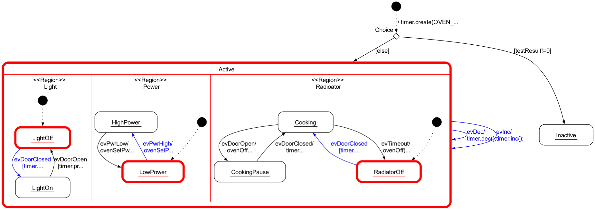

# cmake oven example
This example realizes a microwave oven using c++ 11 features and was created with the integrated state machine editor. It uses regions to separate different parts of the microwave which runs in parallel.

The main.cpp file defines a thread function "eventHandlerThread" that continuously waits for oven events from a thread-safe queue q. Upon receiving an event, it processes it using an instance of the my_oven class (derived from the generated oven class), updating the oven's state, and then prints the innermost active states of the oven. This loop runs indefinitely, ensuring continuous event handling and state monitoring for the oven system.

The main() function initializes the event handling thread and provides a simple command-line interface to stimulate the state machine. You can input commands such as increasing or decreasing cooking time, setting power modes, and opening or closing the oven door (example: ++++oc↲). Commands are translated into specific oven events and pushed into a thread-safe queue for processing by the event handling thread. The simulation continues until the user terminates it by inputting 'q'.

## Build on Windows
On Windows install Visual Studio and the relevant C++ build tools.
Adapt the installation path of the code generator below.
Then open a developer console and cd into the project.

mkdir build
cd build
set JAR_FILE_PATH=c:\sinelaboreRT6.3.2\bin\codegen.jar
cmake  -G "Visual Studio 17 2022" ..\
make

Then open the generated VS project file. cmake creates three project:
 - ALL_BUILD
 - oven
 - ZERO_CHECK

 Set oven as main project to build and run the oven project.

## Build on Linux Subsystem For Win
Required build tools are normally already installed.
Adapt the installation path of the code generator below.
Then open a terminal and cd into the project

mkdir build
cd build
set JAR_FILE_PATH=/home/user/sinelabore/bin/codegen.jar
cmake ..
make
